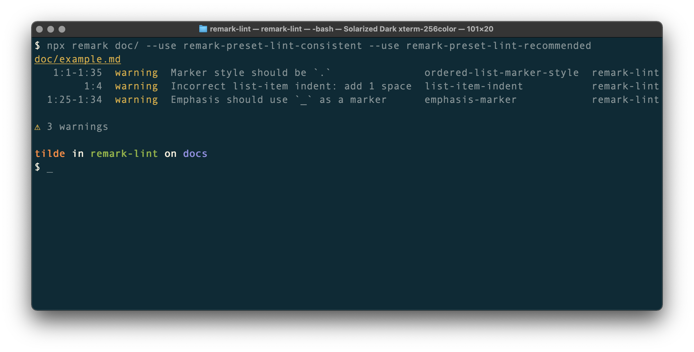

# ![remark-lint][logo]

[![Build][build-badge]][build]
[![Coverage][coverage-badge]][coverage]
[![Downloads][downloads-badge]][downloads]
[![Chat][chat-badge]][chat]
[![Sponsors][sponsors-badge]][collective]
[![Backers][backers-badge]][collective]

**[remark][]** plugins to check (lint) markdown code style.

## Contents

*   [What is this?](#what-is-this)
*   [When should I use this?](#when-should-i-use-this)
*   [Presets](#presets)
*   [Rules](#rules)
*   [Configure](#configure)
*   [Ignore warnings](#ignore-warnings)
*   [Examples](#examples)
    *   [Example: check markdown on the API](#example-check-markdown-on-the-api)
    *   [Example: check and format markdown on the API](#example-check-and-format-markdown-on-the-api)
    *   [Example: check markdown on the CLI](#example-check-markdown-on-the-cli)
    *   [Example: check and format markdown on the CLI](#example-check-and-format-markdown-on-the-cli)
*   [Integrations](#integrations)
*   [Syntax](#syntax)
*   [Compatibility](#compatibility)
*   [Security](#security)
*   [Contribute](#contribute)
*   [License](#license)

## What is this?



You can use this to check markdown.
Say we have a markdown file `doc/example.md` that contains:

```markdown
1) Hello, _Jupiter_ and *Neptune*!
```

Then assuming we installed dependencies and run:

```sh
npx remark doc/ --use remark-preset-lint-consistent --use remark-preset-lint-recommended
```

We would get a report like this:

```txt
doc/example.md
   1:1-1:35  warning  Marker style should be `.`               ordered-list-marker-style  remark-lint
        1:4  warning  Incorrect list-item indent: add 1 space  list-item-indent           remark-lint
  1:25-1:34  warning  Emphasis should use `_` as a marker      emphasis-marker            remark-lint

⚠ 3 warnings
```

This GitHub repository is a monorepo that contains ±70 plugins (each a rule that
checks one specific thing) and 3 presets (combinations of rules configured to
check for certain styles).

These packages are build on [unified][] ([remark][]).
**unified** is a project that inspects and transforms content with abstract
syntax trees (ASTs).
**remark** adds support for markdown to unified.
**mdast** is the markdown AST that remark uses.
These lint rules inspect mdast.

## When should I use this?

This project is useful when developers or technical writers are authoring
documentation in markdown and you want to ensure that the markdown is
consistent, free of bugs, and works well across different markdown parsers.

These packages are quite good at checking markdown.
They especially shine when combined with other [remark plugins][remark-plugin]
and at letting you make your own rules.

## Presets

Presets are combinations of rules configured to check for certain styles.
The following presets only contain lint rules but you can make your own that
include any remark plugins or other presets.
The presets that are maintained here:

<!--presets start-->

*   [`remark-preset-lint-consistent`](https://github.com/remarkjs/remark-lint/tree/main/packages/remark-preset-lint-consistent) — rules that enforce consistency
*   [`remark-preset-lint-markdown-style-guide`](https://github.com/remarkjs/remark-lint/tree/main/packages/remark-preset-lint-markdown-style-guide) — rules that enforce the markdown style guide
*   [`remark-preset-lint-recommended`](https://github.com/remarkjs/remark-lint/tree/main/packages/remark-preset-lint-recommended) — rules that prevent mistakes or stuff that fails across vendors.

<!--presets end-->

## Rules

The rules that are maintained here:

<!--
  👉 **Note**: the following list is automatically generated.
-->

<!--rules start-->

*   [`remark-lint-blockquote-indentation`](https://github.com/remarkjs/remark-lint/tree/main/packages/remark-lint-blockquote-indentation) — warn when block quotes are either indented too much or too little
*   [`remark-lint-checkbox-character-style`](https://github.com/remarkjs/remark-lint/tree/main/packages/remark-lint-checkbox-character-style) — warn when list item checkboxes violate a given style
*   [`remark-lint-checkbox-content-indent`](https://github.com/remarkjs/remark-lint/tree/main/packages/remark-lint-checkbox-content-indent) — warn when list item checkboxes are followed by too much whitespace
*   [`remark-lint-code-block-style`](https://github.com/remarkjs/remark-lint/tree/main/packages/remark-lint-code-block-style) — warn when code blocks do not adhere to a given style
*   [`remark-lint-definition-case`](https://github.com/remarkjs/remark-lint/tree/main/packages/remark-lint-definition-case) — warn when definition labels are not lowercase
*   [`remark-lint-definition-spacing`](https://github.com/remarkjs/remark-lint/tree/main/packages/remark-lint-definition-spacing) — warn when consecutive whitespace is used in a definition
*   [`remark-lint-emphasis-marker`](https://github.com/remarkjs/remark-lint/tree/main/packages/remark-lint-emphasis-marker) — warn when emphasis markers violate the given style
*   [`remark-lint-fenced-code-flag`](https://github.com/remarkjs/remark-lint/tree/main/packages/remark-lint-fenced-code-flag) — warn when fenced code blocks occur without language flag
*   [`remark-lint-fenced-code-marker`](https://github.com/remarkjs/remark-lint/tree/main/packages/remark-lint-fenced-code-marker) — warn when fenced code markers violate the given style
*   [`remark-lint-file-extension`](https://github.com/remarkjs/remark-lint/tree/main/packages/remark-lint-file-extension) — warn when the file’s extension violates the given style
*   [`remark-lint-final-definition`](https://github.com/remarkjs/remark-lint/tree/main/packages/remark-lint-final-definition) — warn when definitions are not placed at the end of the file
*   [`remark-lint-final-newline`](https://github.com/remarkjs/remark-lint/tree/main/packages/remark-lint-final-newline) — warn when a newline at the end of a file is missing
*   [`remark-lint-first-heading-level`](https://github.com/remarkjs/remark-lint/tree/main/packages/remark-lint-first-heading-level) — warn when the first heading has a level other than a specified value
*   [`remark-lint-hard-break-spaces`](https://github.com/remarkjs/remark-lint/tree/main/packages/remark-lint-hard-break-spaces) — warn when too many spaces are used to create a hard break
*   [`remark-lint-heading-increment`](https://github.com/remarkjs/remark-lint/tree/main/packages/remark-lint-heading-increment) — warn when headings increment with more than 1 level at a time
*   [`remark-lint-heading-style`](https://github.com/remarkjs/remark-lint/tree/main/packages/remark-lint-heading-style) — warn when heading style violates the given style
*   [`remark-lint-linebreak-style`](https://github.com/remarkjs/remark-lint/tree/main/packages/remark-lint-linebreak-style) — warn when linebreaks violate a given or detected style
*   [`remark-lint-link-title-style`](https://github.com/remarkjs/remark-lint/tree/main/packages/remark-lint-link-title-style) — warn when link and definition titles occur with incorrect quotes
*   [`remark-lint-list-item-bullet-indent`](https://github.com/remarkjs/remark-lint/tree/main/packages/remark-lint-list-item-bullet-indent) — warn when list item bullets are indented
*   [`remark-lint-list-item-content-indent`](https://github.com/remarkjs/remark-lint/tree/main/packages/remark-lint-list-item-content-indent) — warn when the content of a list item has mixed indentation
*   [`remark-lint-list-item-indent`](https://github.com/remarkjs/remark-lint/tree/main/packages/remark-lint-list-item-indent) — warn when the spacing between a list item’s bullet and its content violates a given style
*   [`remark-lint-list-item-spacing`](https://github.com/remarkjs/remark-lint/tree/main/packages/remark-lint-list-item-spacing) — warn when list looseness is incorrect
*   [`remark-lint-maximum-heading-length`](https://github.com/remarkjs/remark-lint/tree/main/packages/remark-lint-maximum-heading-length) — warn when headings are too long
*   [`remark-lint-maximum-line-length`](https://github.com/remarkjs/remark-lint/tree/main/packages/remark-lint-maximum-line-length) — warn when lines are too long
*   [`remark-lint-no-blockquote-without-marker`](https://github.com/remarkjs/remark-lint/tree/main/packages/remark-lint-no-blockquote-without-marker) — warn when blank lines without markers (\`>\`) are found in a block quote
*   [`remark-lint-no-consecutive-blank-lines`](https://github.com/remarkjs/remark-lint/tree/main/packages/remark-lint-no-consecutive-blank-lines) — warn for too many consecutive blank lines
*   [`remark-lint-no-duplicate-defined-urls`](https://github.com/remarkjs/remark-lint/tree/main/packages/remark-lint-no-duplicate-defined-urls) — warn on definitions that define the same urls
*   [`remark-lint-no-duplicate-definitions`](https://github.com/remarkjs/remark-lint/tree/main/packages/remark-lint-no-duplicate-definitions) — warn on duplicate definitions
*   [`remark-lint-no-duplicate-headings`](https://github.com/remarkjs/remark-lint/tree/main/packages/remark-lint-no-duplicate-headings) — warn on duplicate headings
*   [`remark-lint-no-duplicate-headings-in-section`](https://github.com/remarkjs/remark-lint/tree/main/packages/remark-lint-no-duplicate-headings-in-section) — warn on duplicate headings in a section
*   [`remark-lint-no-emphasis-as-heading`](https://github.com/remarkjs/remark-lint/tree/main/packages/remark-lint-no-emphasis-as-heading) — warn when emphasis or importance is used instead of a heading
*   [`remark-lint-no-empty-url`](https://github.com/remarkjs/remark-lint/tree/main/packages/remark-lint-no-empty-url) — warn on empty URLs in links and images
*   [`remark-lint-no-file-name-articles`](https://github.com/remarkjs/remark-lint/tree/main/packages/remark-lint-no-file-name-articles) — warn when file name start with an article
*   [`remark-lint-no-file-name-consecutive-dashes`](https://github.com/remarkjs/remark-lint/tree/main/packages/remark-lint-no-file-name-consecutive-dashes) — warn when file names contain consecutive dashes
*   [`remark-lint-no-file-name-irregular-characters`](https://github.com/remarkjs/remark-lint/tree/main/packages/remark-lint-no-file-name-irregular-characters) — warn when file names contain irregular characters
*   [`remark-lint-no-file-name-mixed-case`](https://github.com/remarkjs/remark-lint/tree/main/packages/remark-lint-no-file-name-mixed-case) — warn when file names use mixed case
*   [`remark-lint-no-file-name-outer-dashes`](https://github.com/remarkjs/remark-lint/tree/main/packages/remark-lint-no-file-name-outer-dashes) — warn when file names contain initial or final dashes
*   [`remark-lint-no-heading-content-indent`](https://github.com/remarkjs/remark-lint/tree/main/packages/remark-lint-no-heading-content-indent) — warn when heading content is indented
*   [`remark-lint-no-heading-indent`](https://github.com/remarkjs/remark-lint/tree/main/packages/remark-lint-no-heading-indent) — warn when headings are indented
*   [`remark-lint-no-heading-like-paragraph`](https://github.com/remarkjs/remark-lint/tree/main/packages/remark-lint-no-heading-like-paragraph) — for too many hashes (h7+ “headings”)
*   [`remark-lint-no-heading-punctuation`](https://github.com/remarkjs/remark-lint/tree/main/packages/remark-lint-no-heading-punctuation) — warn when headings end in illegal characters
*   [`remark-lint-no-html`](https://github.com/remarkjs/remark-lint/tree/main/packages/remark-lint-no-html) — warn when HTML nodes are used
*   [`remark-lint-no-inline-padding`](https://github.com/remarkjs/remark-lint/tree/main/packages/remark-lint-no-inline-padding) — warn when inline nodes are padded with spaces
*   [`remark-lint-no-literal-urls`](https://github.com/remarkjs/remark-lint/tree/main/packages/remark-lint-no-literal-urls) — warn when URLs without angle brackets are used
*   [`remark-lint-no-missing-blank-lines`](https://github.com/remarkjs/remark-lint/tree/main/packages/remark-lint-no-missing-blank-lines) — warn when missing blank lines
*   [`remark-lint-no-multiple-toplevel-headings`](https://github.com/remarkjs/remark-lint/tree/main/packages/remark-lint-no-multiple-toplevel-headings) — warn when multiple top level headings are used
*   [`remark-lint-no-paragraph-content-indent`](https://github.com/remarkjs/remark-lint/tree/main/packages/remark-lint-no-paragraph-content-indent) — warn when the content in paragraphs are indented
*   [`remark-lint-no-reference-like-url`](https://github.com/remarkjs/remark-lint/tree/main/packages/remark-lint-no-reference-like-url) — warn when URLs are also defined identifiers
*   [`remark-lint-no-shell-dollars`](https://github.com/remarkjs/remark-lint/tree/main/packages/remark-lint-no-shell-dollars) — warn when shell code is prefixed by dollars
*   [`remark-lint-no-shortcut-reference-image`](https://github.com/remarkjs/remark-lint/tree/main/packages/remark-lint-no-shortcut-reference-image) — warn when shortcut reference images are used
*   [`remark-lint-no-shortcut-reference-link`](https://github.com/remarkjs/remark-lint/tree/main/packages/remark-lint-no-shortcut-reference-link) — warn when shortcut reference links are used
*   [`remark-lint-no-table-indentation`](https://github.com/remarkjs/remark-lint/tree/main/packages/remark-lint-no-table-indentation) — warn when tables are indented
*   [`remark-lint-no-tabs`](https://github.com/remarkjs/remark-lint/tree/main/packages/remark-lint-no-tabs) — warn when hard tabs are used instead of spaces
*   [`remark-lint-no-undefined-references`](https://github.com/remarkjs/remark-lint/tree/main/packages/remark-lint-no-undefined-references) — warn when references to undefined definitions are found
*   [`remark-lint-no-unneeded-full-reference-image`](https://github.com/remarkjs/remark-lint/tree/main/packages/remark-lint-no-unneeded-full-reference-image) — warn when full reference images are used if they can be collapsed
*   [`remark-lint-no-unneeded-full-reference-link`](https://github.com/remarkjs/remark-lint/tree/main/packages/remark-lint-no-unneeded-full-reference-link) — warn when full reference links are used if they can be collapsed
*   [`remark-lint-no-unused-definitions`](https://github.com/remarkjs/remark-lint/tree/main/packages/remark-lint-no-unused-definitions) — warn when unused definitions are found
*   [`remark-lint-ordered-list-marker-style`](https://github.com/remarkjs/remark-lint/tree/main/packages/remark-lint-ordered-list-marker-style) — warn when the markers of ordered lists violate a given style
*   [`remark-lint-ordered-list-marker-value`](https://github.com/remarkjs/remark-lint/tree/main/packages/remark-lint-ordered-list-marker-value) — warn when the marker value of ordered lists violates a given style
*   [`remark-lint-rule-style`](https://github.com/remarkjs/remark-lint/tree/main/packages/remark-lint-rule-style) — warn when horizontal rules violate a given style
*   [`remark-lint-strikethrough-marker`](https://github.com/remarkjs/remark-lint/tree/main/packages/remark-lint-strikethrough-marker) — warn when strikethrough markers violate the given style
*   [`remark-lint-strong-marker`](https://github.com/remarkjs/remark-lint/tree/main/packages/remark-lint-strong-marker) — warn when importance (strong) markers violate the given style
*   [`remark-lint-table-cell-padding`](https://github.com/remarkjs/remark-lint/tree/main/packages/remark-lint-table-cell-padding) — warn when table cells are incorrectly padded
*   [`remark-lint-table-pipe-alignment`](https://github.com/remarkjs/remark-lint/tree/main/packages/remark-lint-table-pipe-alignment) — warn when table pipes are not aligned
*   [`remark-lint-table-pipes`](https://github.com/remarkjs/remark-lint/tree/main/packages/remark-lint-table-pipes) — warn when table rows are not fenced with pipes
*   [`remark-lint-unordered-list-marker-style`](https://github.com/remarkjs/remark-lint/tree/main/packages/remark-lint-unordered-list-marker-style) — warn when markers of unordered lists violate a given style

<!--rules end-->

<!--Old ID of this section:-->

<a name="list-of-external-rules"></a>

You can make and share your own rules, which can be used just like the rules
maintained here.
The following rules are maintained by the community:

<!--
  👉 **Note**: this list is ordered based on the name without prefix, so
  excluding `remark-lint-no-` or `remark-lint-`
-->

*   [`remark-lint-alphabetize-lists`](https://github.com/vhf/remark-lint-alphabetize-lists)
    — ensure list items are in alphabetical order
*   [`remark-lint-appropriate-heading`](https://github.com/RichardLitt/remark-lint-appropriate-heading)
    — check that the top level heading matches the directory name
*   [`remark-lint-blank-lines-1-0-2`](https://github.com/vhf/remark-lint-blank-lines-1-0-2)
    — ensure a specific number of lines between blocks
*   [`remark-lint-books-links`](https://github.com/vhf/remark-lint-books-links)
    — ensure links in lists of books follow a standard format
*   [`remark-lint-code`](https://github.com/Qard/remark-lint-code)
    — lint fenced code blocks by corresponding language tags,
    currently supporting [ESLint](https://github.com/Qard/remark-lint-code-eslint)
*   [`remark-lint-match-punctuation`](https://github.com/laysent/remark-lint-plugins/tree/HEAD/packages/remark-lint-match-punctuation)
    — ensures punctuations are used in pairs if necessary.
*   [`remark-lint-mdash-style`](https://github.com/alexandrtovmach/remark-lint-mdash-style)
    — ensure em-dash (`—`) style follows a standard format
*   [`remark-lint-no-chinese-punctuation-in-number`](https://github.com/laysent/remark-lint-plugins/tree/HEAD/packages/remark-lint-no-chinese-punctuation-in-number)
    — ensures that Chinese punctuation’s not used in numbers
*   [`remark-lint-no-dead-urls`](https://github.com/davidtheclark/remark-lint-no-dead-urls)
    — check that external links are alive
*   [`remark-lint-no-long-code`](https://github.com/laysent/remark-lint-plugins/tree/HEAD/packages/remark-lint-no-long-code)
    — ensures that each line in code block won't be too long.
*   [`remark-lint-no-repeat-punctuation`](https://github.com/laysent/remark-lint-plugins/tree/HEAD/packages/remark-lint-no-repeat-punctuation)
    — ensures punctuation is not repeated
*   [`remark-lint-emoji-limit`](https://github.com/zerok/remark-lint-emoji-limit)
    — enforce a limit of emoji per paragraph
*   [`remark-lint-no-empty-sections`](https://github.com/vhf/remark-lint-no-empty-sections)
    — ensure every heading is followed by content (forming a section)
*   [`remark-lint-heading-length`](https://github.com/zerok/remark-lint-heading-length)
    — ensure headings have the appropriate length
*   [`remark-lint-heading-whitespace`](https://github.com/vhf/remark-lint-heading-whitespace)
    — ensure heading parsing is not broken by weird whitespace
*   [`remark-lint-are-links-valid`](https://github.com/wemake-services/remark-lint-are-links-valid)
    — check if your links are reachable and/or unique
*   [`remark-lint-spaces-around-number`](https://github.com/laysent/remark-lint-plugins/tree/HEAD/packages/remark-lint-spaces-around-number)
    — ensures there are spaces around number and Chinese.
*   [`remark-lint-spaces-around-word`](https://github.com/laysent/remark-lint-plugins/tree/HEAD/packages/remark-lint-spaces-around-word)
    — ensures there are spaces around English word and Chinese.
*   [`remark-lint-no-url-trailing-slash`](https://github.com/vhf/remark-lint-no-url-trailing-slash)
    — ensure that the `href` of links has no trailing slash
*   [`remark-lint-write-good`](https://github.com/zerok/remark-lint-write-good)
    — wrapper for `write-good`
*   [`remark-lint-double-link`](https://github.com/Scrum/remark-lint-double-link)
    — ensure the same URL is not linked multiple times.

For help creating your own rule, it’s suggested to look at existing rules and to
[follow this tutorial][tutorial].

## Configure

<!--Old ID of this section:-->

<a name="configuring-remark-lint"></a>

Just like other remark plugins, there are a couple ways to configure rules.
They all follow a standard approach:

*   Pass a severity, options, or both to the rules themselves.
    This affects each rule individually and takes highest precedence.
*   Some rules correspond to settings that are shared among all remark plugins --- particularly [`remark-stringify`](https://github.com/remarkjs/remark/tree/main/packages/remark-stringify#options).
*   Using presets, you can change any combination of rules' severity, rules' options, or shared settings.

```js
import {remark} from 'remark'
import remarkLintFinalNewline from 'remark-lint-final-newline'
import remarkLintMaximumLineLength from 'remark-lint-maximum-line-length'
import remarkLintUnorderedListMarkerStyle from 'remark-lint-unordered-list-marker-style'

remark()
  // Pass `false` to turn a rule off — the code no longer runs:
  .use(remarkLintFinalNewline, false)
  // Pass `true` to turn a rule on again:
  .use(remarkLintFinalNewline, true)
  // You can also configure whether messages by the rule should be ignored,
  // are seen as code style warnings (default), or are seen as exceptions.
  // Ignore messages with `'off'` or `0` as the first value of an array:
  .use(remarkLintFinalNewline, ['off'])
  .use(remarkLintFinalNewline, [0])
  // Use `'warn'`, `'on'`, or `1` to treat messages as code style warnings:
  .use(remarkLintFinalNewline, ['warn'])
  .use(remarkLintFinalNewline, ['on'])
  .use(remarkLintFinalNewline, [1])
  // Use `'error'` or `2` to treat messages as exceptions:
  .use(remarkLintFinalNewline, ['error'])
  .use(remarkLintFinalNewline, [2])
  // Some rules accept options, and what they exactly accept is different for
  // each rule (sometimes a string, a number, or an object).
  // The following rule accepts a string:
  .use(remarkLintUnorderedListMarkerStyle, '*')
  .use(remarkLintUnorderedListMarkerStyle, ['on', '*'])
  .use(remarkLintUnorderedListMarkerStyle, [1, '*'])
  // The following rule accepts a number, numbers *must* be passed in arrays:
  .use(remarkLintMaximumLineLength, ['on', 72])
  .use(remarkLintMaximumLineLength, [1, 72])
```

See [`use()` in `unified`'s readme][unified-use] for more info on how to use
plugins.

Use the following remark settings to configure both the corresponding rules and [`remark-stringify`](https://github.com/remarkjs/remark/tree/main/packages/remark-stringify#options):

<!--settings start-->

| Setting | Rule |
| - | - |
| [`settings.bullet`](https://github.com/remarkjs/remark/tree/main/packages/remark-stringify#optionsbullet) | [`remark-lint-unordered-list-marker-style`](https://github.com/remarkjs/remark-lint/tree/main/packages/remark-lint-unordered-list-marker-style) |
| [`settings.bulletOrdered`](https://github.com/remarkjs/remark/tree/main/packages/remark-stringify#optionsbulletordered) | [`remark-lint-ordered-list-marker-style`](https://github.com/remarkjs/remark-lint/tree/main/packages/remark-lint-ordered-list-marker-style) |
| [`settings.closeAtx`](https://github.com/remarkjs/remark/tree/main/packages/remark-stringify#optionscloseatx) | [`remark-lint-heading-style`](https://github.com/remarkjs/remark-lint/tree/main/packages/remark-lint-heading-style) |
| [`settings.emphasis`](https://github.com/remarkjs/remark/tree/main/packages/remark-stringify#optionsemphasis) | [`remark-lint-emphasis-marker`](https://github.com/remarkjs/remark-lint/tree/main/packages/remark-lint-emphasis-marker) |
| [`settings.fence`](https://github.com/remarkjs/remark/tree/main/packages/remark-stringify#optionsfence) | [`remark-lint-fenced-code-marker`](https://github.com/remarkjs/remark-lint/tree/main/packages/remark-lint-fenced-code-marker) |
| [`settings.fences`](https://github.com/remarkjs/remark/tree/main/packages/remark-stringify#optionsfences) | [`remark-lint-code-block-style`](https://github.com/remarkjs/remark-lint/tree/main/packages/remark-lint-code-block-style) |
| [`settings.incrementListMarker`](https://github.com/remarkjs/remark/tree/main/packages/remark-stringify#optionsincrementlistmarker) | [`remark-lint-ordered-list-marker-value`](https://github.com/remarkjs/remark-lint/tree/main/packages/remark-lint-ordered-list-marker-value) |
| [`settings.listItemIndent`](https://github.com/remarkjs/remark/tree/main/packages/remark-stringify#optionslistitemindent) | [`remark-lint-list-item-indent`](https://github.com/remarkjs/remark-lint/tree/main/packages/remark-lint-list-item-indent) |
| [`settings.quote`](https://github.com/remarkjs/remark/tree/main/packages/remark-stringify#optionsquote) | [`remark-lint-link-title-style`](https://github.com/remarkjs/remark-lint/tree/main/packages/remark-lint-link-title-style) |
| [`settings.rule`](https://github.com/remarkjs/remark/tree/main/packages/remark-stringify#optionsrule) | [`remark-lint-rule-style`](https://github.com/remarkjs/remark-lint/tree/main/packages/remark-lint-rule-style) |
| [`settings.ruleRepetition`](https://github.com/remarkjs/remark/tree/main/packages/remark-stringify#optionsrulerepetition) | [`remark-lint-rule-style`](https://github.com/remarkjs/remark-lint/tree/main/packages/remark-lint-rule-style) |
| [`settings.ruleSpaces`](https://github.com/remarkjs/remark/tree/main/packages/remark-stringify#optionsrulespaces) | [`remark-lint-rule-style`](https://github.com/remarkjs/remark-lint/tree/main/packages/remark-lint-rule-style) |
| [`settings.setext`](https://github.com/remarkjs/remark/tree/main/packages/remark-stringify#optionssetext) | [`remark-lint-heading-style`](https://github.com/remarkjs/remark-lint/tree/main/packages/remark-lint-heading-style) |
| [`settings.strong`](https://github.com/remarkjs/remark/tree/main/packages/remark-stringify#optionsstrong) | [`remark-lint-strong-marker`](https://github.com/remarkjs/remark-lint/tree/main/packages/remark-lint-strong-marker) |

<!--settings end-->

```js
import {remark} from 'remark'
import remarkLintUnorderedListMarkerStyle from 'remark-lint-unordered-list-marker-style'

remark()
  .use(remarkLintUnorderedListMarkerStyle)
  .use({settings: {bullet: '*'}})
```

See [remark][] for how to configure plugins and settings on the API, and [`remark-cli`][remark-cli] for the places the CLI looks for configuration.

> 🧑‍🏫 **Info**: remark lint rules *check* markdown.
> [`remark-stringify`][remark-stringify] *formats* markdown.
> They behave consistently when you change shared settings that they both understand, but not if you pass options to rules individually.
> Passing options to rules individually doesn't affect [`remark-stringify`][remark-stringify] or vice versa.

> 🧑‍🏫 **Info**: messages in `remark-lint` are warnings instead of errors.
> Other linters (such as ESLint) almost always use errors.
> Why?
> Those tools *only* check code style.
> They don’t generate, transform, and format code, which is what remark and
> unified focus on, too.
> Errors in unified mean the same as an exception in your JavaScript code: a
> crash.
> That’s why we use warnings instead, because we continue checking more markdown
> and continue running more plugins.

## Ignore warnings

You can use HTML comments to hide or show warnings from within markdown.
Turn off all remark lint messages with `<!--lint disable-->` and turn them on
again with `<!--lint enable-->`:

```markdown
<!--lint disable-->

[Naiad]: https://naiad.neptune

[Thalassa]: https://thalassa.neptune

<!--lint enable-->
```

You can toggle specific rules by using their names without `remark-lint-`:

```markdown
<!--lint disable no-unused-definitions definition-case-->

[Naiad]: https://naiad.neptune

[Thalassa]: https://thalassa.neptune

<!--lint enable no-unused-definitions definition-case-->
```

You can ignore a message in the next block with `<!--lint ignore-->`:

```markdown
<!--lint ignore-->

[Naiad]: https://naiad.neptune
```

`ignore` also accepts a list of rules:

```markdown
<!--lint ignore no-unused-definitions definition-case-->

[Naiad]: https://naiad.neptune
```

> 👉 **Note**: you’ll typically need blank lines between HTML comments and other
> constructs.
> More info is available at the package that handles comments,
> [`remark-message-control`][remark-message-control].

> 💡 **Tip**: MDX comments are supported when [`remark-mdx`][remark-mdx] is
> used:
>
> ```mdx
> {/* lint ignore no-unused-definitions definition-case */}
> ```

## Examples

### Example: check markdown on the API

The following example checks that markdown code style is consistent and follows
some best practices.
It also reconfigures a rule.
First install dependencies:

```sh
npm install vfile-reporter remark remark-preset-lint-consistent remark-preset-lint-recommended remark-lint-list-item-indent --save-dev
```

Then create a module `example.js` that contains:

```js
import {reporter} from 'vfile-reporter'
import {remark} from 'remark'
import remarkPresetLintConsistent from 'remark-preset-lint-consistent'
import remarkPresetLintRecommended from 'remark-preset-lint-recommended'

main()

async function main() {
  const file = await remark()
    // Check that markdown is consistent.
    .use(remarkPresetLintConsistent)
    // Few recommended rules.
    .use(remarkPresetLintRecommended)
    .use({
      // `settings.listItemIndent` is set to `tab` in the
      // recommended preset, but you can
      // change it if you’d prefer something else:
      settings: {listItemIndent: 'one'}
    })
    .process('1) Hello, _Jupiter_ and *Neptune*!')

  console.error(reporter(file))
}
```

Running that with `node example.js` yields:

```txt
        1:1  warning  Missing newline character at end of file  final-newline              remark-lint
   1:1-1:35  warning  Marker style should be `.`                ordered-list-marker-style  remark-lint
  1:25-1:34  warning  Emphasis should use `_` as a marker       emphasis-marker            remark-lint

⚠ 3 warnings
```

### Example: check and format markdown on the API

remark lint rules *check* markdown.
[`remark-stringify`][remark-stringify] (used in remark) *formats* markdown.

```js
import {reporter} from 'vfile-reporter'
import {remark} from 'remark'
import remarkLintEmphasisMarker from 'remark-lint-emphasis-marker'
import remarkLintStrongMarker from 'remark-lint-strong-marker'

main()

async function main() {
  const file = await remark()
    .use(remarkLintEmphasisMarker)
    .use(remarkLintStrongMarker)
    .use({
      // Configure both the rules and `remark-stringify`.
      settings: {emphasis: '*', strong: '*'}
    })
    .process('_Hello_, __world__!')

  console.error(reporter(file))
  console.log(String(file))
}
```

Yields:

```txt
    1:1-1:8  warning  Emphasis should use `*` as a marker  emphasis-marker  remark-lint
  1:10-1:19  warning  Strong should use `*` as a marker    strong-marker    remark-lint

⚠ 2 warnings
```

```markdown
*Hello*, **world**!
```

Observe that the lint rules check the input and afterwards remark formats using
asterisks.
If that output was given the the processor, the lint rules would be satisfied.

### Example: check markdown on the CLI

This example checks markdown with [`remark-cli`][remark-cli].
It assumes you’re in a Node.js package.
First install dependencies:

```sh
npm install remark-cli remark-preset-lint-consistent remark-preset-lint-recommended remark-lint-list-item-indent --save-dev
```

Then add an npm script to your `package.json`:

```js
  /* … */
  "scripts": {
    /* … */
    "check": "remark . --quiet --frail",
    /* … */
  },
  /* … */
```

> 💡 **Tip**: add ESLint and such in the `check` script too.

Observe that the above change adds a `check` script, which can be run with
`npm run check`.
It runs remark on all markdown files (`.`), shows only warnings and errors
(`--quiet`), and exits as failed on warnings (`--frail`).
Run `./node_modules/.bin/remark --help` for more info on the CLI.

Now add a `remarkConfig` to your `package.json` to configure remark:

```js
  /* … */
  "remarkConfig": {
    "settings": {
      // `settings.listItemIndent` is set to `tab` in the
      // recommended preset, but you can
      // change it if you’d prefer something else:
      "listItemIndent": "one"
    },
    "plugins": [
      "remark-preset-lint-consistent", // Check that markdown is consistent.
      "remark-preset-lint-recommended" // Few recommended rules.
    ]
  },
  /* … */
```

> 👉 **Note**: you must remove the comments in the above examples when
> copy/pasting them, as comments are not supported in `package.json` files.

Finally run the npm script to check markdown files in your project:

```sh
npm run check
```

### Example: check and format markdown on the CLI

remark lint rules *check* markdown.
The CLI can *format* markdown.
Please first follow the previous example (checking markdown on the CLI) and then
change the npm script:

```js
  /* … */
  "scripts": {
    /* … */
    "format": "remark . --quiet --frail --output",
    /* … */
  },
  /* … */
```

The script is now called `format` to reflect what it does.
It now includes an `--output` flag, which means it will overwrite existing files
with changes.

Update `remarkConfig`:

```js
  /* … */
  "remarkConfig": {
    "settings": {
      "emphasis": "*",
      "strong": "*"
    },
    "plugins": [
      "remark-preset-lint-consistent",
      "remark-preset-lint-recommended"
    ]
  },
  /* … */
```

`settings` configures both the rules and
[`remark-stringify`](https://github.com/remarkjs/remark/tree/main/packages/remark-stringify#options), and explicitly prefers asterisks
for emphasis and strong.
Install the new dependencies:

```sh
npm install remark-lint-emphasis-marker remark-lint-strong-marker --save-dev
```

Finally run the npm script to format markdown files in your project:

```sh
npm run format
```

> 👉 **Note**: running `npm run format` now checks *and* formats your files.
> The first time you run it, assuming you have underscores for emphasis and
> strong, it would first warn and then format.
> The second time you run it, no warnings should appear.

## Integrations

*   [`linter-remark`](https://github.com/wooorm/linter-remark)
    ([Atom](https://atom.io))
    — use remark from Atom
*   [`vscode-remark-lint`](https://github.com/drewbourne/vscode-remark-lint)
    ([VS Code](https://code.visualstudio.com))
    — use `remark-lint` from Visual Studio Code
*   [`SublimeLinter-contrib-remark-lint`](https://packagecontrol.io/packages/SublimeLinter-contrib-remark-lint)
    ([Sublime](https://www.sublimetext.com))
    — use `remark-lint` from Sublime Text
*   [`ale`](https://github.com/w0rp/ale)
    ([Vim](https://www.vim.org))
    — use `remark-lint` from Vim
*   [`jest-runner-remark`](https://github.com/keplersj/jest-runner-remark)
    ([Jest](https://jestjs.io))
    — use remark with Jest

## Syntax

Markdown is parsed by [`remark-parse`][remark-parse] (included in `remark`)
according to CommonMark.
You can combine it with other plugins to add syntax extensions.
Notable examples that deeply integrate with it are
[`remark-gfm`][remark-gfm],
[`remark-mdx`][remark-mdx],
[`remark-frontmatter`][remark-frontmatter],
[`remark-math`][remark-math], and
[`remark-directive`][remark-directive].

## Compatibility

Projects maintained by the unified collective are compatible with all maintained
versions of Node.js.
As of now, that is Node.js 12.20+, 14.14+, and 16.0+.
Our projects sometimes work with older versions, but this is not guaranteed.

## Security

Use of `remark-lint` does not change the tree so there are no openings for
[cross-site scripting (XSS)][xss] attacks.
Messages from linting rules may be hidden from user content though, causing
builds to fail or pass.

## Contribute

See [`contributing.md`][contributing] in [`remarkjs/.github`][health] for ways
to get started.
See [`support.md`][support] for ways to get help.

This project has a [code of conduct][coc].
By interacting with this repository, organization, or community you agree to
abide by its terms.

## License

[MIT][license] © [Titus Wormer][author]

<!-- Definitions -->

[build-badge]: https://github.com/remarkjs/remark-lint/workflows/main/badge.svg

[build]: https://github.com/remarkjs/remark-lint/actions

[coverage-badge]: https://img.shields.io/codecov/c/github/remarkjs/remark-lint.svg

[coverage]: https://codecov.io/github/remarkjs/remark-lint

[downloads-badge]: https://img.shields.io/npm/dm/remark-lint.svg

[downloads]: https://www.npmjs.com/package/remark-lint

[chat-badge]: https://img.shields.io/badge/chat-discussions-success.svg

[chat]: https://github.com/remarkjs/remark/discussions

[sponsors-badge]: https://opencollective.com/unified/sponsors/badge.svg

[backers-badge]: https://opencollective.com/unified/backers/badge.svg

[collective]: https://opencollective.com/unified

[health]: https://github.com/remarkjs/.github

[contributing]: https://github.com/remarkjs/.github/blob/main/contributing.md

[support]: https://github.com/remarkjs/.github/blob/main/support.md

[coc]: https://github.com/remarkjs/.github/blob/main/code-of-conduct.md

[license]: license

[author]: https://wooorm.com

[unified]: https://github.com/unifiedjs/unified

[unified-use]: https://github.com/unifiedjs/unified#processoruseplugin-options

[remark]: https://github.com/remarkjs/remark

[remark-cli]: https://github.com/remarkjs/remark/tree/main/packages/remark-cli

[remark-parse]: https://github.com/remarkjs/remark/tree/main/packages/remark-parse

[remark-stringify]: https://github.com/remarkjs/remark/tree/main/packages/remark-stringify

[remark-plugin]: https://github.com/remarkjs/remark#plugins

[remark-message-control]: https://github.com/remarkjs/remark-message-control

[remark-gfm]: https://github.com/remarkjs/remark-gfm

[remark-frontmatter]: https://github.com/remarkjs/remark-frontmatter

[remark-math]: https://github.com/remarkjs/remark-math

[remark-directive]: https://github.com/remarkjs/remark-directive

[remark-mdx]: https://github.com/mdx-js/mdx/tree/main/packages/remark-mdx

[logo]: https://raw.githubusercontent.com/remarkjs/remark-lint/014fca7/logo.svg?sanitize=true

[xss]: https://en.wikipedia.org/wiki/Cross-site_scripting

[tutorial]: doc/create-a-custom-rule.md
